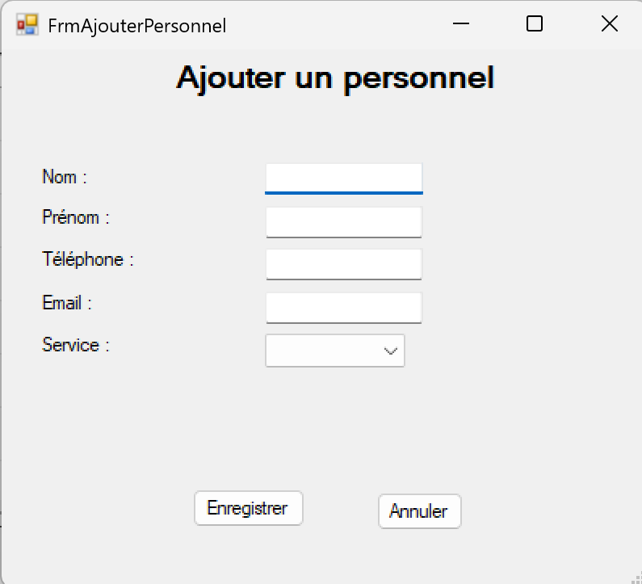
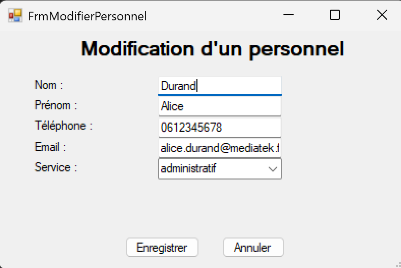
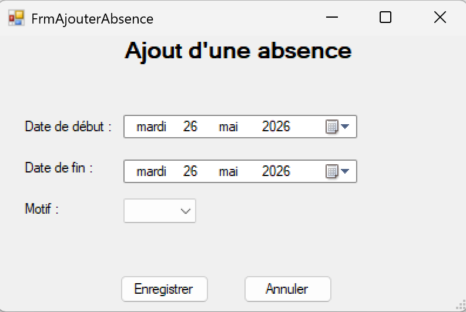
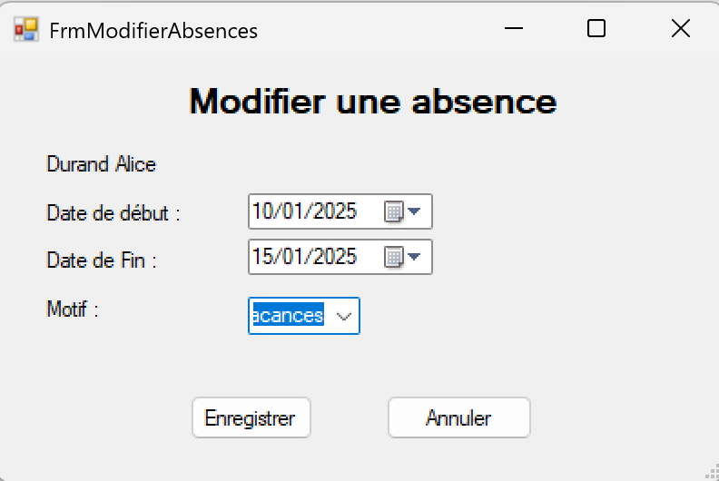

# Application CNED86 - Gestion des absences

---

## 1. Contexte du projet
Cette application a été développée dans le cadre de l'atelier 2 du BTS SIO SLAM.

Elle permet la gestion des absences du personnel (ajout, modification, suppression, consultation).

---

## 2. Objectif de l’application
L’objectif est de fournir un outil de gestion des absences permettant de centraliser les informations des personnels, services et motifs.

## Cas d'utilisation couverts

L'application permet de :

- Se connecter en tant que responsable
- Ajouter un personnel
- Modifier un personnel
- Supprimer un personnel
- Consulter les absences
- Ajouter une absence
- Modifier une absence
- Supprimer une absence
- Empêcher le chevauchement des périodes d'absence

---

## 3. Fonctionnalités
- Authentification utilisateur
- Gestion des personnels
- Gestion des services
- Gestion des motifs d’absence
- Gestion des absences (CRUD)
- Interface de consultation

---

## 4. Technologies utilisées
- C#
- Windows Forms
- MySQL  (XAMPP)
- Visual Studio
- Git / GitHub

---

## 5. Base de données
Le script SQL complet est fourni dans le dépôt.

Il contient :
- création des tables
- relations entre tables
- données d’exemple
- création utilisateur et droits

---

## 6. Modélisation

### MCD

### Diagramme de paquetages

---

## 7. Interfaces de l’application

### Connexion

### Gestion du personnel

### Ajout d'un personnel

### Modifier un personnel

### Gestion des absences

### Ajout d'une absence

### Modifier une absence

---

---

## 8. Installation de l’application
1. Installer XAMPP
2. Importer la base de données
3. Lancer l’installeur (.msi)
4. Exécuter l’application

---

## Historique des commits

### 1. Initialisation du projet
Mise en place de la solution Visual Studio, organisation de l’architecture générale (Model, View, Controller, DAL) et création du dépôt Git.

### 2. Ajout de la base de données
Création et intégration de la base de données MySQL (via XAMPP). Mise en place des tables principales : personnel, absence, service, motif et responsable.

### 3. Création des interfaces utilisateur
Développement des interfaces Windows Forms permettant l’interaction utilisateur (navigation principale et formulaires de gestion).

### 4. Mise en place de l’authentification
Développement du système de connexion avec vérification des identifiants via la table responsable.

### 5. Gestion du personnel
Implémentation des fonctionnalités CRUD (ajout, modification, suppression, affichage) pour la gestion des employés.

### 6. Gestion des absences
Création du module de gestion des absences avec liaison aux tables personnel et motif.

### 7. Création du README et documentation
Rédaction du fichier README, ajout des captures d’écran (MCD, interfaces, architecture) et documentation complète du projet.

### 8. Génération de l’installeur
Création du package d’installation permettant de déployer l’application sur un autre poste utilisateur.

---

## 10. Améliorations possibles
- Export PDF
- Recherche avancée
- Gestion des rôles
