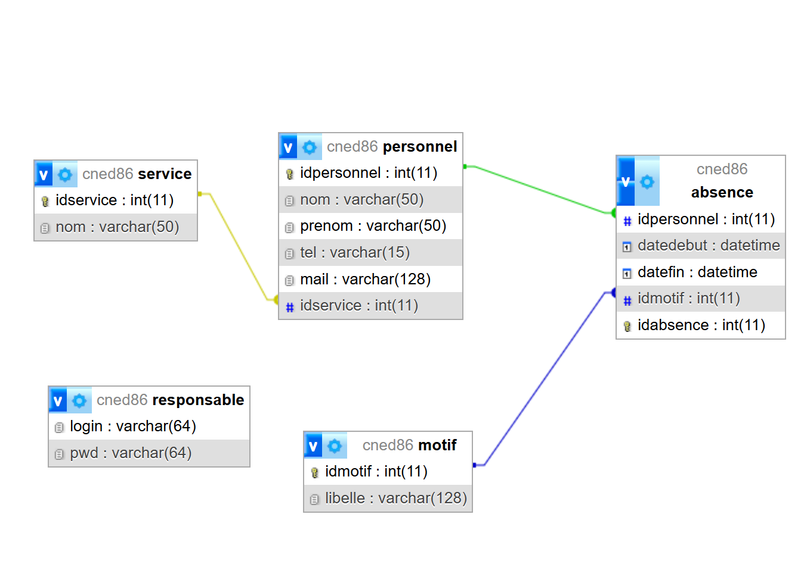
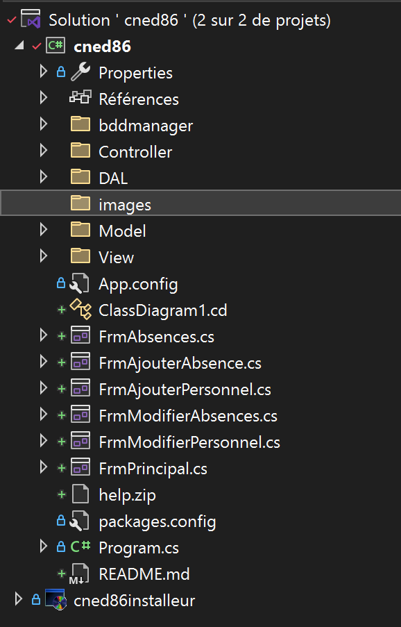
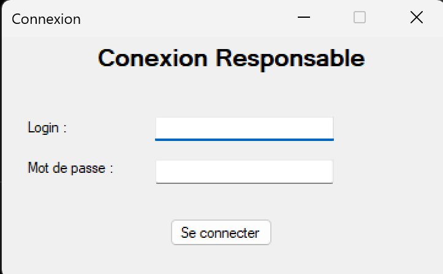
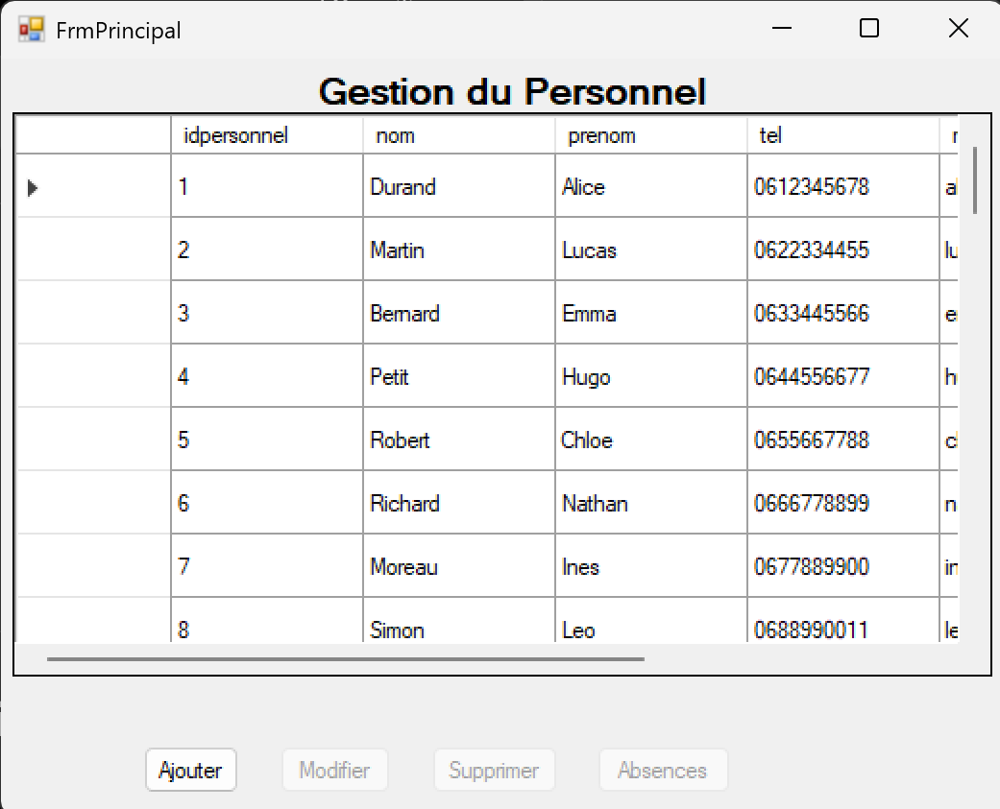
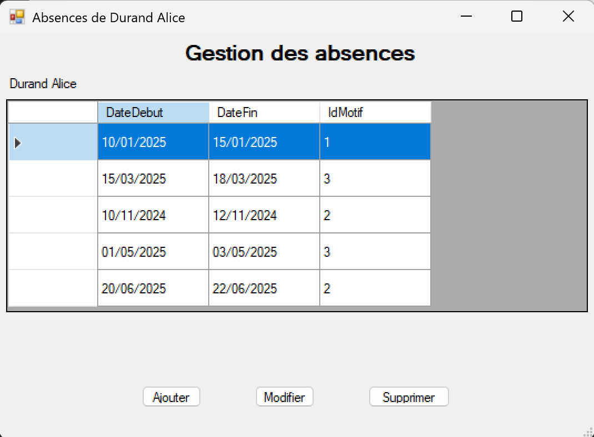

# Application CNED86 - Gestion des absences

---

## 1. Contexte du projet
Cette application a été développée dans le cadre de l'atelier 2 du BTS SIO SLAM.

Elle permet la gestion des absences du personnel (ajout, modification, suppression, consultation).

---

## 2. Objectif de l’application
L’objectif est de fournir un outil de gestion des absences permettant de centraliser les informations des personnels, services et motifs.

---

## 3. Fonctionnalités
- Authentification utilisateur
- Gestion des personnels
- Gestion des services
- Gestion des motifs d’absence
- Gestion des absences (CRUD)
- Interface de consultation

---

## 4. Technologies utilisées
- C#
- Windows Forms
- MySQL  (XAMPP)
- Visual Studio
- Git / GitHub

---

## 5. Base de données
Le script SQL complet est fourni dans le dépôt.

Il contient :
- création des tables
- relations entre tables
- données d’exemple
- création utilisateur et droits

---

## 6. Modélisation

### MCD

### Diagramme de paquetages

---

## 7. Interfaces de l’application

### Connexion

### Gestion du personnel

### Gestion des absences

---

## 8. Installation de l’application
1. Installer XAMPP
2. Importer la base de données
3. Lancer l’installeur (.msi)
4. Exécuter l’application

---

## 9. Historique des commits
- Initialisation du projet
- Création de la base de données
- Mise en place de l’authentification
- Développement des interfaces
- Ajout des fonctionnalités CRUD
- Création de l’installeur

---

## 10. Améliorations possibles
- Export PDF
- Recherche avancée
- Gestion des rôles
